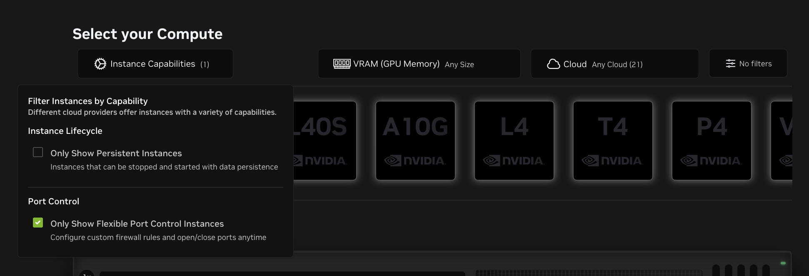
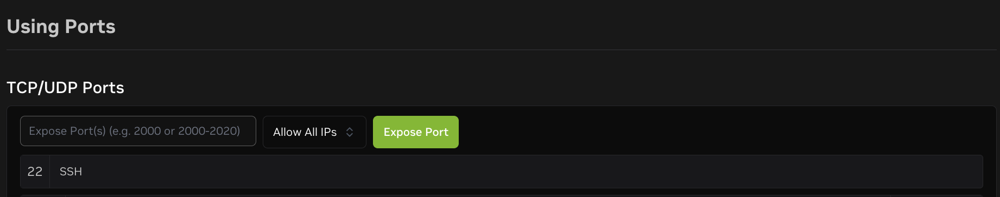
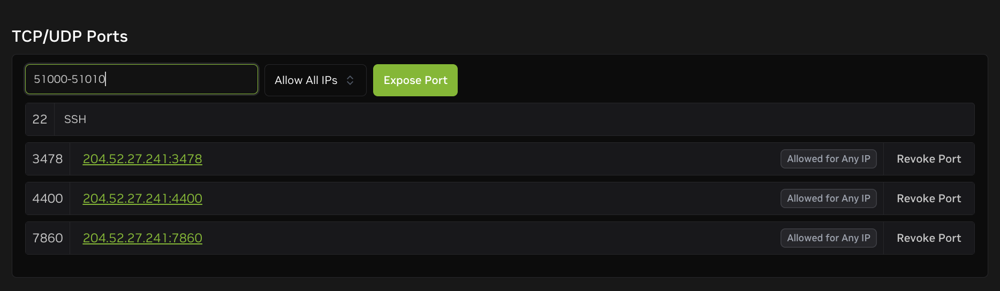
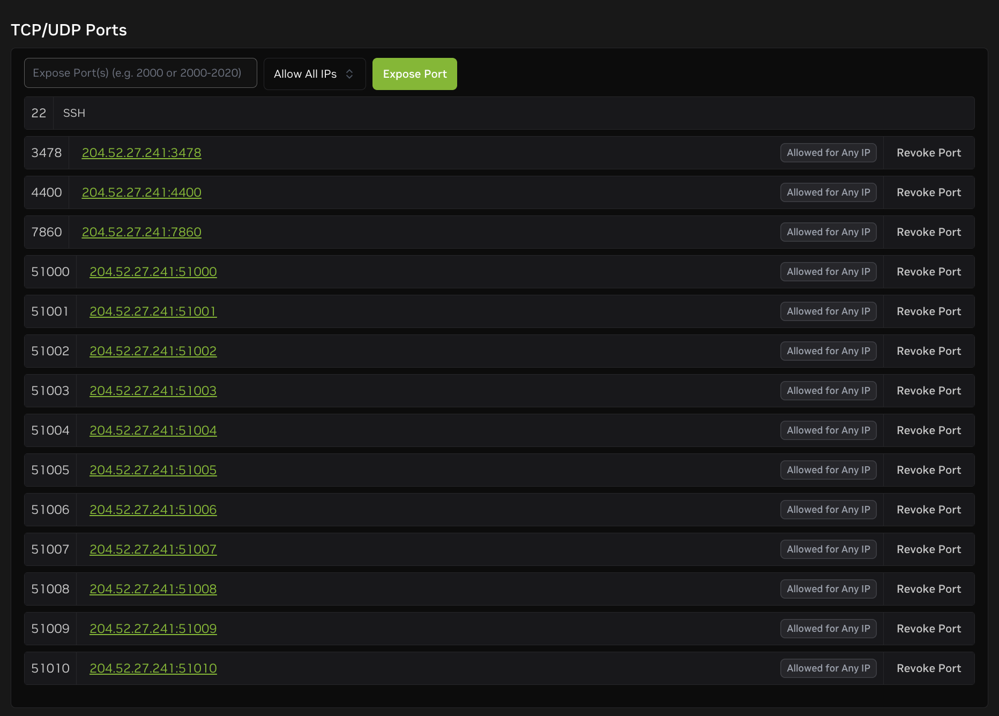
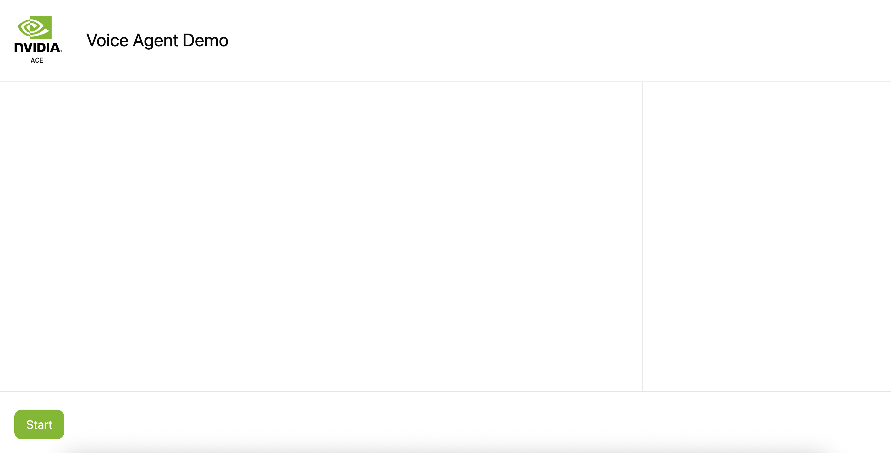
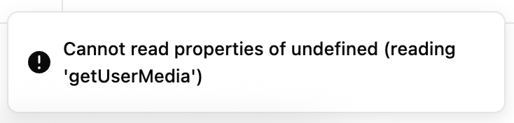
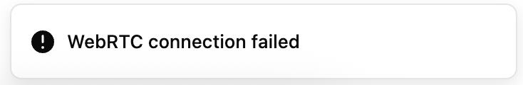

### Coturn server

A TURN server is needed for WebRTC connections when clients are behind NATs or firewalls that prevent direct peer-to-peer communication. The TURN server acts as a relay to ensure connectivity in restrictive network environments.

> Note: This is needed for deployment on Brev. 

If on Brev, before proceeding further, make sure the instance provider type you're on enables exposing TCP/UDP Ports. This is required for the Turn server. 

You could filter Brev instance types that support exposing TCP/UDP ports by selecting "Only Show Flexible Port Control Instances" under "Instance Capabilities".


In the Access console of your Brev instance page, it should look like this:



Before bringing up the applications in `ace-controller-voice-interface`, follow the steps in this section to utilize a Turn server.

#### Step 1: Run the Turn server docker container
```sh
# get this machin'es public ip
export HOST_IP_EXTERNAL=$(curl -s ifconfig.me)
# see the ip
echo $HOST_IP_EXTERNAL
# bring up a coturn server
docker run -d --name turn-server --network=host instrumentisto/coturn -n --verbose --log-file=stdout --external-ip=$HOST_IP_EXTERNAL --listening-ip=0.0.0.0 --lt-cred-mech --fingerprint --user=admin:admin --no-multicast-peers --realm=tokkio.realm.org --min-port=51000 --max-port=51010
```
#### Step 2: Modify ace-controller app configuration
Next, modify the `ace_controller.env` file and `config.ts` file under `ace-controller-voice-interface`. The `config.ts` file will be utilized in the docker build process for the ui-app container from the webrtc_ui example.
```sh
# check the content of the existing ace-controller-voice-interface/ace_controller.env
cat ace-controller-voice-interface/ace_controller.env
# add three relevant env vars to ace-controller-voice-interface/ace_controller.env
echo -e "\n\nTURN_USERNAME=admin\nTURN_PASSWORD=admin\nTURN_SERVER_URL=turn:$HOST_IP_EXTERNAL:3478" >> ace-controller-voice-interface/ace_controller.env
# check the modified content of the ace-controller-voice-interface/ace_controller.env
cat ace-controller-voice-interface/ace_controller.env
```
```sh
# next check the content of the existing config.ts file
cat ace-controller-voice-interface/config.ts
# replace the ice server definition in config.ts
sed -i "s/export const RTC_CONFIG = {};/export const RTC_CONFIG: ConstructorParameters<typeof RTCPeerConnection>[0] = {\n    iceServers: [\n      {\n        urls: \"turn:$HOST_IP_EXTERNAL:3478\",\n        username: \"admin\",\n        credential: \"admin\",\n      },\n    ],\n  };/" ace-controller-voice-interface/config.ts
# next check the modified content of the config.ts file
cat ace-controller-voice-interface/config.ts
```

#### Step 3: Expose ports on your cloud provider instance

On the cloud provider instance, make sure the following ports are exposed:
- 4400
- 7860
- 3478
- 51000-51010 (this is from the range specified by the Turn server docker run command)

If on Brev, expose the ports using the `TCP/UDP Ports` section in your web console's `Access` tab.


In the end your section should look like this:


#### Step 4: restart the ace-controller app if needed
Restart the ace-controller profile if you have already spun it up. Otherwise, please return to the deployment documentation that linked you to this turn-server documentation now and skip the rest of this turn-server documentation. 

```sh
# if you have already spun up the ace-controller profile in ace-controller-voice-interface/docker-compose.yml, 
# first bring it down:
docker compose --profile ace-controller -f ace-controller-voice-interface/docker-compose.yml down
```

```sh
# the rebuild is needed, specifing --build 
docker compose --profile ace-controller -f ace-controller-voice-interface/docker-compose.yml up --build -d
```

#### Step 5: Go to the Voice UI in your Web Browser
First, to enable microphone access in Chrome, go to `chrome://flags/`, enable "Insecure origins treated as secure", add `http://<machine-ip>:4400` to the list, and restart Chrome.

Next, go to `http://<machine-ip>:4400` in your browser to visit the voice UI. Upon loading, the page should look like the following:



#### Troubleshooting 
##### Permission Issue
If you're getting an error `Cannot read properties of undefined (reading 'getUserMedia')`, that means you have not enabled microphone access in Chrome. Go to `chrome://flags/`, enable "Insecure origins treated as secure", add `http://<machine-ip>:4400` to the list, and restart Chrome.



##### Timeout Issue
If you're getting a timeout issue where the button shows `Connecting...` and then "WebRTC connection failed", double check all the steps in the document. It's likely due to incorrect configurations.



After setting the correct configurations, make sure to **close the browser tab**, and open a new browser tab to access the application. If that doesn't seem to work, clear your browser cache and open the link again.

---

### OpenShift / Helm (`ambient-patient`)

WebRTC needs **TURN on both sides**: the Python peer (`pipeline-patient.py`) and the **browser** (via `RTC_CONFIG` in `ace-controller-voice-interface/config.ts`).

1. **Run coturn** (or another TURN service) reachable from both the cluster and user browsers. Expose UDP **3478** (and your relay port range, e.g. **51000–51010**).

2. **Helm / deploy** — set the same TURN URL and credentials the browser will use (see `deploy/ambient-patient/values.yaml` under `aceControllerPipeline`):
   - `turnServerUrl` — e.g. `turn:turn.example.com:3478`
   - `turnUsername` / `turnPassword`

   **`deploy/deploy-app.sh`** reads **`TURN_SERVER_URL`**, **`TURN_USERNAME`**, **`TURN_PASSWORD`** from the **current shell environment** (it does not read files by itself). Either export them, or load your usual file then deploy:

   ```bash
   export TURN_SERVER_URL='turn:turn.example.com:3478'
   export TURN_USERNAME='...'
   export TURN_PASSWORD='...'
   ./deploy/deploy-app.sh
   ```

   ```bash
   set -a && source ace-controller-voice-interface/ace_controller.env && set +a && ./deploy/deploy-app.sh
   ```

   These map to `TURN_SERVER_URL`, `TURN_USERNAME`, `TURN_PASSWORD` on the ace-controller-pipeline pod. Verify with `oc exec deploy/<release>-ace-controller-pipeline -n "$NAMESPACE" -- env | grep '^TURN_'`.

   Advanced (optional): `deploy/turn-overrides.yaml` merged if present; see `deploy/turn-overrides.yaml.example`.

3. **Rebuild the voice UI image** with matching Vite build args so the **browser** embeds the same TURN in `RTC_CONFIG`:

   ```bash
   export VITE_TURN_URLS='turn:turn.example.com:3478'
   export VITE_TURN_USERNAME='...'
   export VITE_TURN_PASSWORD='...'
   ./deploy/build-images.sh ace-controller-ui
   oc rollout restart deployment -l app.kubernetes.io/component=ui-app -n "${NAMESPACE:-ambient-patient}"
   ```

   The UI Dockerfile passes `VITE_TURN_*` into `npm run build` (see `Dockerfile-webrtc-ui`).

4. **Firewall / NetworkPolicy** — allow **UDP** from clients to the TURN relay ports and from pods to TURN.

The OpenShift Route for `/api/ws` already sets long WebSocket timeouts (`haproxy.router.openshift.io/timeout-tunnel`); optional server WebSocket pings are enabled in `pipeline-patient.py` to help with idle proxies.

The UI Docker build runs **`patch-webrtc-vite.cjs`** so `vite.config.ts` gets **`build.target: "esnext"`** — required because **`config.ts` uses top-level await** to load `/api/ice_config`. If you build the webrtc UI **outside** Docker, run `node patch-webrtc-vite.cjs` once in that app directory (or set the same `build.target` in Vite).

The upstream **`waitForICEGatheringComplete`** only watches **`iceGatheringState === "complete"`**. With **TURN**, some browsers stay in **`gathering`** for a long time; completion is also signaled by an **`icecandidate`** event with **`candidate === null`**. This repo **overrides** `waitForICEGatheringComplete.ts` to resolve on **either** signal, with a **60 s** safety timeout.

#### Python peer (aioice) and Metered

The browser loads ICE from **`GET /api/ice_config`** (Metered REST). The pipeline’s **Python** WebRTC stack (aioice) must use the **same** ephemeral credentials as the browser’s `RTCPeerConnection`. A **second** Metered REST call when the WebSocket opens can return **different** short-lived usernames/passwords, which often surfaces as **STUN 401** / **CHANNEL_BIND** errors in aioice even though ICE may still connect intermittently.

This repo’s **webrtc UI** sends **`iceServers`** on the first **`/api/ws`** message (same array the page used for the offer). The pipeline **prefers** that payload and falls back to Metered REST or static **`TURN_*`**. For the **Python** peer only, entries are merged by `(username, credential)`, non-TURN URLs are dropped, then **one** UDP **`turn:`** URL per group is chosen when possible — aioice often returns STUN **401** on **`CHANNEL_BIND`** if it is given many Metered endpoints at once (mixed UDP/TLS).

Rebuild the **ace-controller-ui** image after changing `hooks/use-pipecat-webrtc.ts` or `Dockerfile-webrtc-ui`.

**aioice still logs STUN 401 on `CHANNEL_BIND`:** try, on the **pipeline** pod only:

- `PIPELINE_AIOICE_PREFER=tls` — use `turns:` / TCP if UDP to Metered is blocked.
- `PIPELINE_AIOICE_MAX_TURN_GROUPS=1` (default) — only the first TURN credential group (Metered sometimes returns several).
- `PIPELINE_ICE_USE_STATIC_ONLY=true` — ignore Metered REST for the **Python** peer and use static **`TURN_*`** from the dashboard (browser can still use `/api/ice_config`). Use when Metered ephemeral REST and aioice do not agree.

#### Metered REST API (API key server-side)

Do **not** embed your Metered API key in the browser bundle. The pipeline exposes **`GET /ice_config`**, which proxies to Metered using **`METERED_TURN_API_KEY`** (and optional **`METERED_CREDENTIALS_URL`**, default `https://fax.metered.live/api/v1/turn/credentials`). Set these via Helm (`aceControllerPipeline.meteredTurnApiKey`) or `deploy-app.sh` with `METERED_TURN_API_KEY`.

The response is always `{ "iceServers": [ ... ] }`.

**UI build:** by default the Dockerfile sets **`VITE_ICE_FROM_PIPELINE=true`**, which bakes in a **top-level await** in `config.ts` so `RTC_CONFIG` is filled from **`/api/ice_config`** before the app runs. Pass **`VITE_ICE_FROM_PIPELINE=false`** at build time to use only static **`VITE_TURN_*`**. If both pipeline ICE and static TURN are unavailable, the browser may only gather **`typ host`** candidates (see DevTools) and ICE will fail across NAT.

Alternatively, bake static Metered URLs with **`VITE_TURN_URLS`** + username/password at build time.

#### Troubleshooting: DevTools shows only `host` ICE candidates

That means **no STUN reflexive (`srflx`) and no TURN relay** were used. Fix: ensure **`METERED_TURN_API_KEY`** on the pipeline and a UI build with default pipeline ICE (or full **`VITE_TURN_*`** if you set **`VITE_ICE_FROM_PIPELINE=false`**), then hard-refresh the page.